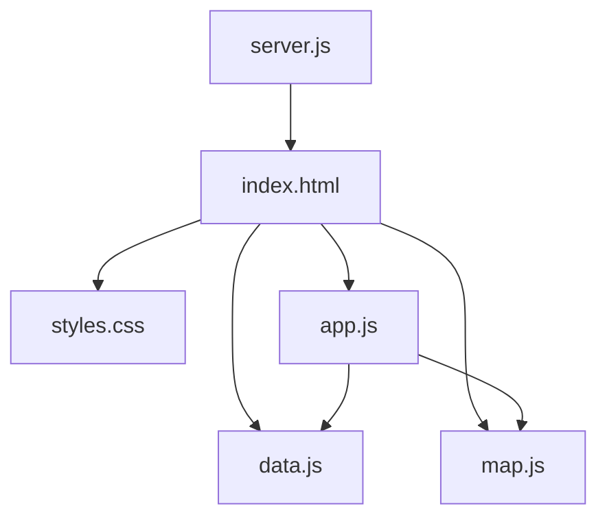
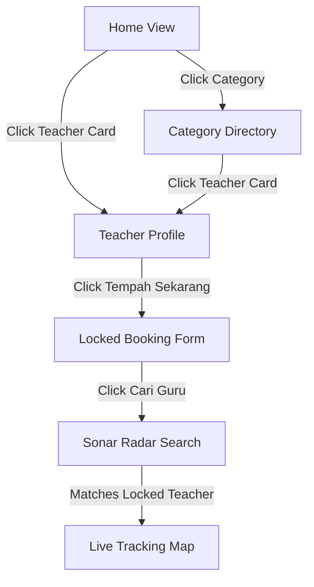

# 🕌 AgamaKu - AI Context & Engineering Document

Welcome, AI Agent! This document provides a full, comprehensive, and detailed context of the **AgamaKu** codebase. Read this file first to gain immediate technical alignment on the architecture, UX patterns, database structures, and testing flows.

---

## 📌 1. Project Overview & Architecture
**AgamaKu** is a premium, mobile-first, and desktop-responsive web application that simulates an **"Islamic Grab-style" booking marketplace**. It connects users looking for Islamic religious services (Mengaji, Tadabbur, Ceramah, Tahlil, Ruqyah) with qualified Ustaz & Ustazah partners.

The application features a **Dual-Mode Simulator**:
1. **User Mode**: Browse services, search directories, view rich profiles with reviews, lock a booking to a specific teacher, request a class, track travel routes in real time, and chat with teachers.
2. **Partner Mode (Ustaz Dashboard)**: Go online, listen for job alerts (with synthesized acoustic chimes), review incoming offers, accept bookings, and manage active classes.

### 🛠️ Technology Stack
- **Frontend**: Pure HTML5 (semantic layout), Vanilla CSS3 (custom variables, responsive grids, advanced animations), and Vanilla Javascript (ES6 modular patterns).
- **Mapping**: Interactive road networks and real-time pin travels drawn on a real **Leaflet.js** map instance connected to **OpenStreetMap** tiles, with real street routing paths calculated by the **Open Source Routing Machine (OSRM)** API.
- **Location**: Uses browser `navigator.geolocation` API to pinpoint the user's exact GPS coordinates.
- **Audio Soundscapes**: In-browser sound synthesis utilizing the **Web Audio API** (generates pure custom sound frequencies on request—no static `.mp3` assets required).
- **Backend/Hosting**: Lightweight Node.js developer server with automated port scanning fallback, connected to an internal **SQLite** database for real-time bookings, ratings, and live chat syncing.

---

## 📂 2. File Directory & Component Registry

Below is the directory structure and the exact engineering purpose of each file:



### 📄 [index.html](file:///d:/Tengku/AgamaKu/index.html)
The central structure of the application. It employs a **dual-viewport display** pattern:
- **Emulator Viewport Frame**: Renders the mobile app with a realistic phone notch (camera/speaker block) and bottom safe-area curved corners.
- **Desktop Showcase Viewport**: An informational presentation panel shown to desktop users explaining the application features.
- **Widescreen Desktop Workspace Mode**: When activated, the phone emulator frame scales to 100% of the viewport and reflows into a proper premium desktop dashboard.
- **Dynamic Views**: Managed via CSS classes (`.active`) for screen transitions:
  - `#home-view`: Service categories, featured promos, active sliders, and list of nearby teachers.
  - `#teachers-list-view`: Category-filtered teacher directory with flexible tag reset bars.
  - `#teacher-profile-view`: Premium glowing credentials card, detailed biography, and database-driven ratings and reviews list.
  - `#booking-view`: Locked/Unlocked booking form with dynamic gender toggles and live pricing cards.
  - `#searching-view`: Animated sonar radar scanning window.
  - `#active-job-view`: Pinned vector tracking map canvas, live travel dispatcher, and dual-simulation controller tabs.
  - `#partner-dashboard-view`: The independent Ustaz profile controller panel.

### 📄 [styles.css](file:///d:/Tengku/AgamaKu/styles.css)
The design system of AgamaKu, tailored with high-end, Islamic-inspired visual tokens:
- **Emerald Green & Gold HSL Palette**:
  ```css
  --primary-emerald: 160, 95%, 15%;     /* Deep rich Islamic emerald */
  --accent-gold: 45, 93%, 47%;          /* Glowing warm metallic gold */
  --bg-dark: 165, 85%, 3%;               /* Sleek near-black emerald background */
  ```
- **Keyframe Animations**:
  - `@keyframes pulse-avatar`: Animates pulsing multi-ring glowing boundaries around verified avatars.
  - `@keyframes pulse-ring`: Radar sonar ripple sweeps.
  - `@keyframes scan-line`: Sweeps scanning overlays.
- **Responsive Widescreen Reflows**: Includes full media queries targeting viewports larger than `1024px`. Automatically reflows vertical lists into a **3-column horizontal grid**, scales the Canvas map side-by-side with dispatch panels, and builds a premium left navigation sidebar (`260px` width).

### 📄 [data.js](file:///d:/Tengku/AgamaKu/data.js)
Houses the static mock databases that serve the application:
- `initialServices`: Listing titles, icons, and base booking rates.
- `initialUstazList`: Teacher profiles including:
  - Personal credentials (age, gender, hourly rates).
  - Spatial coordinates (X/Y relative vectors used by the Canvas map).
  - Academic background (e.g., Al-Azhar, Islamic University of Madinah).
  - Verified badges and primary service tag mappings.
- `initialReviews`: Dynamic list of ratings and student feedback comments.

### 📄 [map.js](file:///d:/Tengku/AgamaKu/map.js)
A custom mapping engine bridging Leaflet.js with the Open Source Routing Machine (OSRM):
- Connects to an HTML5 `<div id="mapContainer">` element and injects Leaflet map tiles.
- Animates real-time custom SVG avatar markers along valid street geometries parsed from OSRM GeoJSON routes.
- Handles pulsing search radius circles and automatic map bounds fitting.

### 📄 [app.js](file:///d:/Tengku/AgamaKu/app.js)
The core operational logic and state machine of AgamaKu:
- **Central State**:
  ```javascript
  const appState = {
    userRole: 'user',              // 'user' or 'partner'
    partnerOnline: false,          // Partner availability toggle
    activeBooking: null,           // Current active class information
    selectedTeacher: null,         // Object of locked teacher (or null)
    userLocation: null,            // Browser Geolocation Lat/Lng
    // ... tracking states, messages, timers
  };
  ```
- **Booking & Chat Polling Dispatcher**:
  - Automatically polls `/api/bookings` and `/api/bookings/chat` for real-time status and chat synchronization across devices.
  - Manages the transition from category directory scans -> detailed biography reviews -> pre-locked bookings.
  - Connects matched jobs to a multi-synthesizer alert loop.
- **Web Audio Chime Loop**: Integrates the standard synthesizer (`playNotificationSound()`) that generates pure golden major-triad acoustic tones dynamically when incoming jobs arrive or chat messages are received.

### 📄 [server.js](file:///d:/Tengku/AgamaKu/server.js)
A robust Node.js development server utilizing the built-in HTTP module:
- Implements a port fallback scanner: If port 3000 is occupied or restricted (common on local Windows setups), it increments the port number and retries until binding succeeds.
- Lists and prints the exact local network Wi-Fi IP address in the terminal console so that the developer can instantly access `http://<local-network-ip>:<port>` on a physical mobile phone for cross-device testing.

---

## 🕌 3. The Core User Flows & UI Controllers



### A. Teacher Directory & Filtering (`openCategoryTeachers`)
- Triggers when clicking a homepage service category icon or "Lihat Semua".
- Receives the category name (e.g., `'tadabbur'`) or `'all'`.
- Filters `initialUstazList` based on teacher specialty mappings.
- Appends a green filter badge at the top of the UI. Clicking the close `(x)` on this badge triggers `clearCategoryFilter()` which refreshes the list to display all teachers.

### B. Detailed Profile Reviews & Glows (`openTeacherProfile`)
- Triggers when clicking any teacher card.
- Automatically caches the preceding view in `appState.profileBackView` so the "Kembali" back button routes the viewport back to the correct screen (Home vs Directory).
- Generates rating summaries and loops reviews filtered from `initialReviews`.
- Dynamically applies a glowing pulse avatar ring to verified profiles.

### C. Locked Pre-Selected Booking Flow
- Triggers when clicking "Tempah Sekarang" on a profile page.
- Locks `appState.selectedTeacher` to the teacher's profile.
- Renders `#booking-locked-teacher` banner showing the selected teacher's avatar and name inside the booking form.
- Automatically selects their matching category, updates the price estimator using their personal hourly rate, and hides the gender preference selector (since the teacher is locked).
- Clicking "Batal" triggers `clearSelectedTeacher()`, resetting the form back to random match mode.

### D. Dual-Mode Simulation Architecture (`startBookingSearch`)
- **Case 1: Unlocked (Random Match)**: Spins the sonar search for 4 seconds, then selects a random teacher based on selected gender preference and service type.
- **Case 2: Locked to any teacher EXCEPT Ustaz Zulkifli Harun** (e.g. Ustazah Fatimah): Spins the sonar search, then bypasses random selection and directly matches them.
- **Case 3: Locked to Ustaz Zulkifli Harun (Partner Mode)**:
  - If **Partner is Offline**: Displays a toast alerting that Ustaz Zulkifli is currently offline (advising the user to toggle partner mode online).
  - If **Partner is Online**: Locks the job to Ustaz Zulkifli, triggers a persistent synthesized chime soundscape, and prompts the user to switch to the Partner Dashboard to manually view and accept the job!

---

## 🧪 4. Testing & Verification Sequences

Here are the precise steps to test these premium workflows:

### Scenario A: Booking a Specific Teacher (Ustazah Fatimah)
1. On the Homepage, scroll to **Ustaz & Ustazah Terdekat** and click **Ustazah Fatimah Az-Zahra**.
2. Notice the large glowing avatar and verify her university biography and reviews are populated from the database.
3. Click **Tempah Sekarang**.
4. Inside the booking form, verify:
   - The locked header card is active at the top.
   - The hourly price displays **RM 40.00 / jam** (Fatimah's rate).
   - The gender selection block is hidden.
5. Click **Cari Guru Sekarang**.
6. The search radar runs for 4 seconds, matches her, and initializes the canvas path travel vector tracking on the map!

### Scenario B: Partner Dual-Mode Class Acceptance (Ustaz Zulkifli)
1. Switch to the **Partner Mode** dashboard by clicking the partner toggle in the navigation bar.
2. Click **Pergi Online** (turns the indicator green).
3. Switch back to **User Mode** and go to **Ustaz Zulkifli Harun**'s profile.
4. Click **Tempah Sekarang** -> select a date -> click **Cari Guru Sekarang**.
5. The radar begins spinning, and the Web Audio chime begins playing persistent alert pings.
6. Click **Tukar ke Mod Ustaz (Partner)**.
7. Click the green **Terima Tempahan** button inside the incoming alert card.
8. Switch back to **Mod Pelajar (User)**.
9. **Result**: Both screens are locked into the active class tracking screen, displaying road path travel updates in real time!

---

## 🔒 5. Development Integrity & Ignore Configurations
To prevent file index pollution and context bloat across different developer PCs and AI agent sessions, the following ignore configuration files are established in the root directory:
- **[`.gitignore`](file:///d:/Tengku/AgamaKu/.gitignore)**: Standard Git boundaries (excludes `node_modules/`, database files, OS templates, environment secrets, and AI agent log directories).
- **[`.cursorignore`](file:///d:/Tengku/AgamaKu/.cursorignore)**: Tells Cursor's semantic indexing engine to completely bypass local AI logs (`.gemini/`, `.antigravity/`, `brain/`, `scratch/`, `.system_generated/`), keeping file scans lightning fast.
- **[`.windsurfignore`](file:///d:/Tengku/AgamaKu/.windsurfignore)**: Matches the `.cursorignore` configuration to ensure Windsurf agents are equally performant.

---

*This document is maintained as a structural compass for AgamaKu. Happy Coding!*
